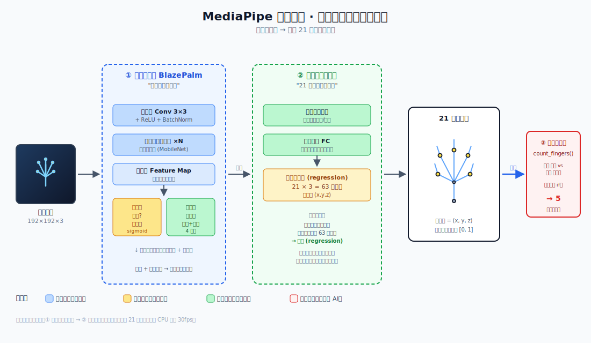
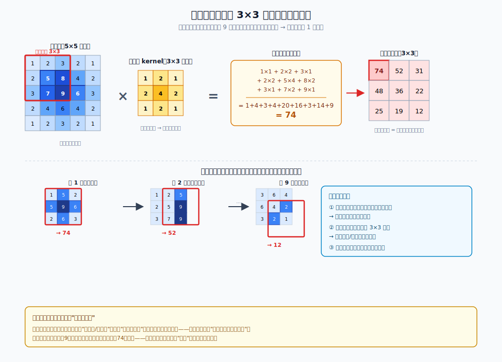
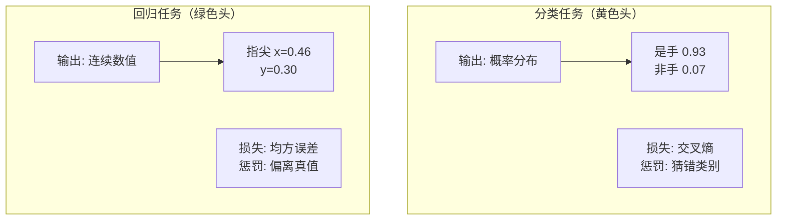
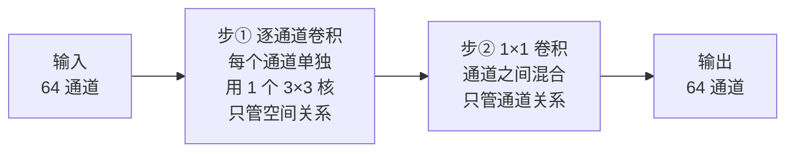
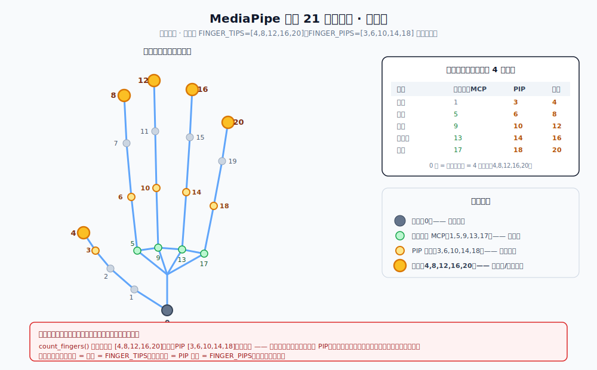

# 从手势识别看深度学习的「两阶段检测」

> 对着摄像头伸出一把手指，屏幕上就蹦出数字 5——这中间发生了什么？本项目打开电脑摄像头，实时识别画面里的手势，数出伸直的手指数量，输出阿拉伯数字 `0~5`，并用方框框出手的位置、画出 21 个关键点骨架。
>
> 表面上这只是一行 `landmarker.detect_for_video()` 调用，背后却藏着现代计算机视觉最经典的一招：**让神经网络不直接给出答案，而是先「找位置」再「标细节」**。本文就把这个黑盒拆开，看清楚每一段是谁干的活。



上图从左到右画出了整条流水线。蓝色框是第一阶段（找手掌），绿色框是第二阶段（标 21 个点），最右红色框才是本项目代码 `count_fingers()` 做的事——一个连神经网络都算不上的几何比较。下面逐段讲。

---

## 知识点一：为什么是「两阶段」而不是「一步到位」

一个朴素的想法是：训练一个大网络，输入整张图，直接输出 21 个关键点。这在原理上可行，但实际很难用——因为**手在画面里通常很小，而背景很大**。一个要在 1280×720 整图上精确定位手指尖的网络，绝大部分算力都浪费在了"没有手的背景"上。

MediaPipe（以及大多数现代检测框架）用的是**两阶段流水线（two-stage pipeline）**：


**核心思想**：用一个轻量网络先把"感兴趣区域"（手在哪）圈出来，裁成一张只含手的小图，再让昂贵的精密网络只在这张小图上跑。这就像先用望远镜找到猎物，再换显微镜看细节——每一步都用对的工具。

> 💡 这种"先粗后精"的思想不只用在视觉。人类眼睛的**中央凹（fovea）**就是同理：视野边缘分辨率很低（粗扫），一旦发现目标，眼球转动让目标落到中央凹（精看）。两阶段网络本质是在模仿这个机制。

代价是多了一次前向传播，但因为第二阶段输入图小得多（192×192），总耗时反而比单阶段跑整图更短——所以能在普通笔记本 CPU 上跑到 30fps。

---

## 知识点二：卷积层到底在「卷」什么

上图里反复出现的"卷积层 Conv 3×3"是所有现代视觉网络的砖块。它做的事可以用一个比喻说清：

> 拿一个小小的 3×3 滤镜（叫**卷积核 kernel**），在图像上从左到右、从上到下滑动。每滑到一个位置，就把滤镜盖住的 9 个像素和滤镜里的 9 个权重相乘再求和，得到一个输出值。整张图滑完，就得到一张"响应图"——哪里对这种模式反应强，哪里就亮。

不同的卷积核学习不同的模式：有的对**垂直边缘**敏感，有的对**皮肤颜色**敏感，有的对**手指这种细长形状**敏感。一个卷积层有几十到几百个核，叠在一起，就组成了对图像的多角度"特征素描"。

下图把这个滑动过程画了出来——一个 3×3 核在 5×5 图上滑动，每停一次产出一个值：



看左上角第一次滑动：核盖住图中央数值最大的区域（9、8、7、6 等），与"中心权重大"的核相乘后求和得到 74——这正是输出响应图里最大的那个值。**这说明卷积在用"乘加运算"定位"哪里最像核所代表的模式"**。

**关键性质**——为什么用卷积而不是普通的矩阵乘法：

| 性质 | 含义 | 好处 |
|------|------|------|
| 局部连接 | 每个输出只看 3×3 邻域 | 学到的是"局部模式"（边缘、角）而非整图 |
| 权值共享 | 同一个核在整图上滑动复用 | 参数量极少；且"在左上角学到的边缘特征，在右下角也能用" |
| 平移等变 | 物体挪个位置，响应也跟着挪 | 手出现在画面哪都能认——这正是检测要的 |

把很多卷积层堆起来，网络的"感受野"（一个输出最终看了多大区域）逐层扩大：浅层看 3×3（线条），中层看一片（指节），深层看半张图（整只手）。这就是上图里"逐步降采样 → 特征被压缩"的含义。

> 💡 项目代码里你自己也用过类似的"滑动窗口"思想——`mouse_sensor` 项目里的相位相关法，本质也是在两帧之间找"哪块区域最相似"。卷积是"找一个模式在哪"，相位相关是"找整块图位移了多少"，都是**用滑动匹配来定位**。

---

## 知识点三：回归 vs 分类——网络最后一层的设计分野

这是本项目最值得理解的概念。看上图的两个输出头，颜色不同：

**分类头（黄色）**——回答"这是什么"。第一阶段用它判断"这块区域是不是手"。输出是**离散的**：是手 / 不是手，通常配 `sigmoid` 把结果压成 0~1 的概率。训练时用**交叉熵损失**衡量"猜错类别"的程度。

**回归头（绿色）**——回答"数值是多少"。第二阶段用它输出 21 个点的坐标。输出是**连续的实数**：x、y、z 各是多少，没有类别可言。训练时用**均方误差 MSE** 衡量"猜偏了多少像素"。

> ⚠️ 很多人误以为 AI 识别手势是"先把手分类成拳头/剪刀/布"。**不是**。MediaPipe 走的是回归路线：它直接吐出 `21 × 3 = 63` 个实数（每个点 x、y、z），手形信息全编码在这 63 个数里。至于"这 63 个数代表数字几"，是项目代码 `count_fingers()` 在网络外面用规则判的。

代码里能看到这个回归结果的形态——`gesture_demo.py:100`：

```python
pts = [(lm.x * image_width, lm.y * image_height) for lm in landmarks]
```

`landmarks` 就是那 63 个数（21 个点，每点 x、y、z），其中 x、y 被归一化到 `[0, 1]`，乘以画面宽高才变回像素坐标。**这一行在做的事，就是把神经网络回归出的抽象数值，翻译回屏幕上的像素位置。**

两者训练目标的对比：



记住一句话：**输出"是哪一类"用分类，输出"是多少"用回归。** 手势坐标是"是多少"，所以是回归。

---

## 知识点四：深度可分离卷积——为什么手机也能实时跑

上图第一阶段标注了"深度可分离卷积（MobileNet）"。这是 MediaPipe 能在手机端 30fps 的关键技术，普通卷积太贵，它做了个聪明的拆分。

**普通卷积**（一次做完）：一个 3×3 核同时处理"空间关系"（左右上下的像素怎么组合）和"通道关系"（红绿蓝之间怎么混合）。假设输入 64 通道、输出 64 通道，一个 3×3 核要学 `3×3×64×64 = 36864` 个参数。

**深度可分离卷积**（拆成两步）：



拆完后同样的输入输出，参数量降到约 `3×3×64 + 64×64 ≈ 4672` 个——**差不多省了 8 倍**。代价是表达能力略降，但实测对手部检测这种"目标结构相对固定"的任务够用。

> 💡 直觉理解：普通卷积让一个核同时背两份工（空间+通道），累且费参数；拆开后两个小核各司其职，更省、更快。这是**"分解"思想**在神经网络里的体现——和把一个大数分解成两个小数相乘是同一种智慧。

项目里你下载的 `hand_landmarker.task` 才 7.5MB，能跑这么小，深度可分离卷积功不可没。配合 **float16 量化**（每个参数从 32 位砍到 16 位，体积再减半），才有了这个能在 CPU 上实时跑的模型。

---

## 知识点五：图像坐标系——为什么 y 是向下的

这是项目代码里好几个"反直觉"细节的根源。OpenCV（以及大多数图像库）用的坐标系是：

```
   (0,0) ──────── x 向右 ───────►
     │
     │
   y 向下
     │
     ▼
```

**y 轴向下增长**，和数学课本里 y 向上正好相反。原因很历史：图像在内存里是**按行存储**的，第 0 行在最上面，行号（即 y）往下递增。于是"y 小 = 在画面上方"。

这个设定直接决定了项目核心算法 `gesture_demo.py:112` 的写法：

```python
for tip, pip in zip(FINGER_TIPS[1:], FINGER_PIPS[1:]):
    states.append(pts[tip][1] < pts[pip][1])   # 指尖 y < 指根 y → 伸直
```

"指尖的 y 比指根的 y **小**，说明指尖在指根**上方**，即手指伸直"。如果你忘了 y 向下，这行 `<` 会写成 `>`，结果就全反了。

另一个连带效应是**镜像翻转后的左右手互换**（`gesture_demo.py:204`、`218`）：

```python
frame = cv2.flip(frame, 1)          # 水平翻转成"镜子"
...
label = "Left" if raw == "Right" else "Right"   # 翻转后左右对调
```

翻转后画面里"左"和"右"对调，MediaPipe 在翻转图上判断的 `Left/Right` 也跟着反，所以代码要再换回来——否则大拇指的伸/弯判断（依赖左右手方向）会出错。**改一处要跟改另一处**，这是图像坐标系 + 几何变换叠加产生的连锁后果。

> 💡 这套"y 向下、原点在左上"的坐标约定，在游戏开发（屏幕渲染）、GUI 编程、图像处理里几乎通用。但遇到 OpenGL、数学绘图（matplotlib）这类 y 向上的系统时就要小心翻转。同一个"坐标"，约定不同，算法的符号就要跟着变。

---

## 知识点六：包围盒——「画个框」背后的极简几何

画面上那圈标记手势位置的绿框（`gesture_demo.py:136-142`），背后是最朴素的几何运算：

```python
xs = [p[0] for p in pts]
ys = [p[1] for p in pts]
x1, x2 = max(0, min(xs) - pad), min(w, max(xs) + pad)
y1, y2 = max(0, min(ys) - pad), min(h, max(ys) + pad)
```

这就是**轴对齐包围盒（AABB, Axis-Aligned Bounding Box）**：取所有关键点 x 的最小最大值、y 的最小最大值，围成一个正好框住所有点的矩形。它不旋转、和图像边平行，所以叫"轴对齐"。

为什么用 AABB 而不是更贴合手形的旋转框？

| 维度 | AABB（本项目用的） | 旋转框（OBB） |
|------|--------------------|---------------|
| 计算 | 一次 min/max，O(n) | 要算主方向、PCA，O(n) 但常数大 |
| 碰撞检测 | 4 次比较即可 | 要考虑旋转矩阵 |
| 紧凑度 | 框里有很多空白 | 更贴合 |
| 适用 | 显示、粗定位 | 精确测量 |

对"画个框给用户看"这种需求，AABB 的简单彻底压倒了 OBB 的精确。这是工程里反复出现的取舍：**够用就好，别过度设计。**

> 💡 AABB 在游戏物理引擎里也是基石——两个矩形框是否重叠，只需比较 4 个数（`a.x1 < b.x2 and a.x2 > b.x1 and ...`），快得惊人。所谓"碰撞检测"的第一道粗筛，几乎都是 AABB。

---

## 把整条链路串起来

回到开头的问题：伸出一把手指，数字 5 是怎么蹦出来的？

1. **OpenCV** 从摄像头缓冲区抓一帧（`cap.read()`，`gesture_demo.py:199`）——这是**系统调用**，库封装好的。
2. 帧被水平翻转（`flip`，`204`），变成镜子视图——**纯 numpy 运算**，无 AI。
3. **MediaPipe 第一阶段** BlazePalm：一个深度可分离卷积网络扫整图，回归出手掌边界框——**神经网络，分类+回归头**。
4. 裁出手掌小图，**MediaPipe 第二阶段** 关键点网络：回归出 63 个数（21 点 × xyz）——**神经网络，纯回归头**。
5. **我们的 `count_fingers()`**：比较指尖与指根的 y 坐标，数出 5 根伸直——**几何规则，零 AI**。
6. **OpenCV** 画框、画骨架、显示数字（`draw_result`，`125-165`）——**绘图调用**。

整条链路里，真正"智能"的只有第 3、4 步，而且那是 Google 训好的模型；本项目代码贡献的是第 5 步——一个 `if` 比较。理解了这一点，就理解了"调用 AI"和"实现 AI"的距离：**前者是把别人训练好的大脑接到自己的规则上，后者是从零搭建并训练那个大脑。** 本项目是前者，但把它讲明白，恰恰是迈向后者的第一步。

---

# 附录：实现细节与上手指南

> 以下是工程实现层面的参考——怎么跑、代码怎么判手指、文件怎么组织。读完了上面的原理，这部分是动手时的查阅手册。

## 21 个关键点

MediaPipe HandLandmarker 把每只手抽象成 21 个点（编号固定）：



记住这张图的编号规律——**每根手指 4 个点**：手腕(0) → 掌指关节 MCP → PIP → 指尖。指尖的编号是 4 的倍数（4, 8, 12, 16, 20），这正是项目代码里 `FINGER_TIPS = [4,8,12,16,20]` 的来源。

有了这 21 个点的坐标，任意手势就被「编码」成了一组数字。

## 数手指的算法（核心）

判断一根手指伸没伸直，只要看 **指尖** 和它下面那一级 **关节（PIP）** 的相对位置：

| 手指   | 判定（图像坐标，y 向下）                       |
|--------|------------------------------------------------|
| 食/中/无名/小指 | 指尖 y < PIP y（指尖在关节上方）→ 伸直 |
| 大拇指 | 指尖 x 比 IP 关节更「靠外」→ 伸直（左右手方向相反）|

数一下伸直的手指，就是结果数字。这是一个**纯几何规则**，不需要训练分类器，因此又快又稳。

## 为什么画面要镜像翻转

摄像头拍到的其实是「别人眼中的我」，左右是反的。我们 `cv2.flip(frame, 1)` 做水平镜像后，画面才像照镜子一样符合直觉。但 MediaPipe 是在**翻转后**的画面上判断左右手的，所以它报的 `Left/Right` 与真实手相反，代码里要做一次互换。

## 快速上手

```bash
# 依赖（OpenCV 已随 Anaconda 自带，mediapipe 需单独安装）
pip install mediapipe

# 运行（模型文件 hand_landmarker.task 已随项目附带，缺时自动下载）
python gesture_demo.py
```

> **注意（numpy 冲突）**：MediaPipe 在 Windows 上的发行版只支持较新的 API（见上文「回归 vs 分类」一节），
> 安装时若把 numpy 升到 2.x，可能破坏同环境里用 numpy 1.x 编译的包（如 matplotlib/scipy）。
> 出问题时用 `pip install "numpy<2"` 回退即可，MediaPipe 的推理在 numpy 1.26 下正常工作。

运行后会弹出摄像头画面：

- 镜头前伸出 0~5 根手指，画面正中会出现对应的大号数字
- 绿框圈出当前手的位置，并画出关节骨架
- 按 `q` 退出

## 文件说明

| 文件 | 作用 |
|------|------|
| `gesture_demo.py` | 主程序：采集摄像头 → 关键点检测 → 数手指 → 绘制方框与数字 |
| `hand_landmarker.task` | MediaPipe 官方手部关键点模型（float16，约 7.5 MB） |
| `images/nn_architecture.svg` | 配图：两阶段神经网络流水线结构图 |
| `images/convolution_sliding.svg` | 配图：卷积核滑动过程示意 |
| `images/hand_landmarks_21.svg` | 配图：21 个手部关键点编号图 |

## 许可

本项目仅供学习用途。MediaPipe 遵循 Apache 2.0 协议。
