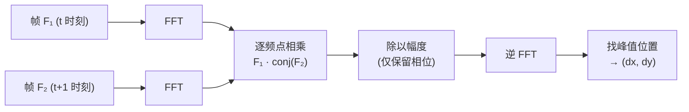
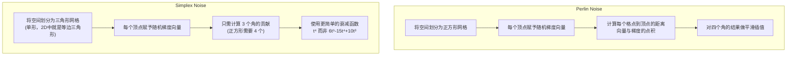
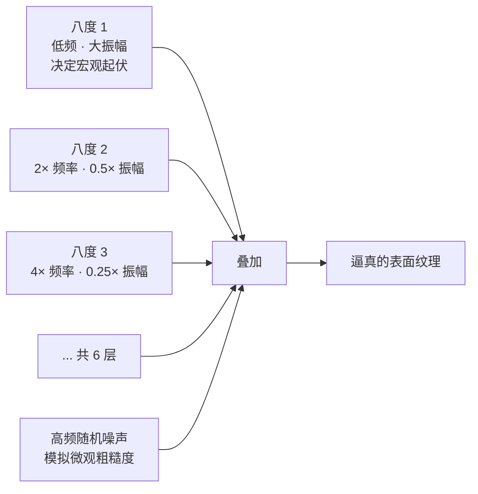
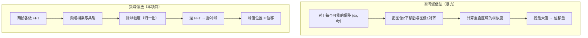
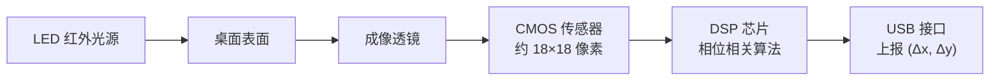
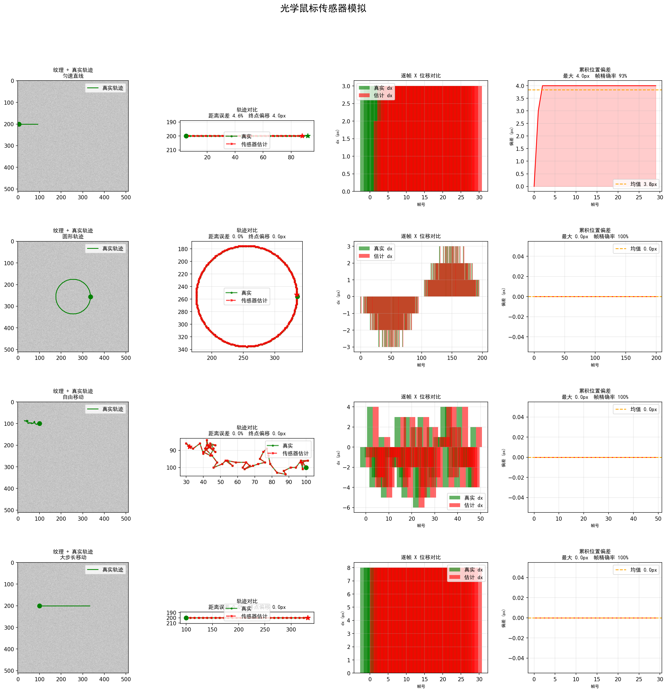

# 从光学鼠标传感器理解傅里叶变换与程序化纹理生成

> 每天握在手里的鼠标，底部那个小红灯照亮的小窗口里发生了什么？这个项目用 Python 从零模拟了一颗光学鼠标传感器芯片的核心工作流程：生成表面纹理、逐帧拍摄、通过频域相位相关计算位移、最终还原出鼠标的运动轨迹。在这个过程中，我们将理解傅里叶变换如何从"抽象的数学工具"变成"芯片里的位移检测器"，以及 Simplex Noise 如何用几行代码生成以假乱真的自然纹理。

---

## 一、频域相位相关——两幅图像之间的位移检测

### 什么是相位相关？

当鼠标在桌面上移动一个像素时，传感器拍到的两帧图像几乎一模一样——只是整体平移了一点点。问题是：如何精确地知道平移了多少？

最直觉的做法叫**互相关（cross-correlation）**：把第二张图在所有可能的偏移位置上与第一张图对齐，找最匹配的那个偏移量。但这个暴力搜索在二维图像上代价是 O(N⁴)。

相位相关巧妙地利用了**傅里叶变换的平移性质**，把这个搜索搬到频域里完成，代价降为 O(N² log N)。

其数学核心是一个优美的定理：

> 若图像 g(x, y) 是图像 f(x, y) 平移 (dx, dy) 的结果，那么它们的傅里叶变换满足：
> G(u, v) = F(u, v) · e^(-j2π(u·dx + v·dy))
>
> 换言之，两幅图在频域中**幅度相同**，只有**相位**不同，而相位差恰好编码了位移量。

### 项目中的实现

`mouse_sensor_demo.py:121-134` 中的 `estimate_displacement` 函数：

```python
cross = np.fft.fft2(prev) * np.conj(np.fft.fft2(curr))
mag = np.abs(cross)
mag[mag < 1e-10] = 1e-10
corr = np.real(np.fft.ifft2(cross / mag))
peak = np.unravel_index(np.argmax(corr), corr.shape)
```

这三行就是整个算法：
1. 对两帧图像分别做二维 FFT，取其中一个的共轭后相乘
2. 除以幅度（只保留相位信息），再做逆 FFT
3. 结果是一个"脉冲峰"——峰值出现的位置就是位移量



> 💡 想象两个人各拿一张纸，纸上画着相同的图案但错开了位置。你把两张纸叠在一起对着光看——当图案对齐时，透光最多。相位相关就是用频域的"透光"来找到对齐的位置，只不过它不是暴力挪动，而是一次性算出答案。

---

## 二、离散傅里叶变换（DFT）——从时域到频域的桥梁

### 为什么需要傅里叶变换？

上面用到的 `np.fft.fft2` 做了一件什么事？它把一张空间域的图像分解成一组不同频率的"基础波"的叠加。

一维 DFT 的定义：

> X[k] = Σ_{n=0}^{N-1} x[n] · e^(-j2πkn/N)

直觉上：输入是一个长度为 N 的信号，输出也是长度为 N，但每个输出元素 X[k] 代表"频率为 k 的那个正弦波有多强"。

二维 DFT 就是先对每一行做一维 DFT，再对每一列做——这就是 `fft2` 的含义。

### 平移性质的直觉解释

如果把一张图像向右移 3 个像素，它的频率内容（每种波的强度）完全不变——因为图案还是那个图案。变的只是每种频率的**起始相位**。

类比：同一首歌曲，不管你从第几秒开始播放，它的音高（频率）不变，变的是你从哪个相位开始听。

正是这个性质让相位相关成为可能：频域里"幅度不变、相位编码位移"。

---

## 三、Simplex Noise——比 Perlin Noise 更好的程序化噪声

### 为什么需要噪声函数？

模拟鼠标传感器需要一个逼真的表面纹理——像鼠标垫、桌面那样有随机但连续的微观凹凸。普通的随机数（白噪声）太乱，完全规则的图案又太整齐。我们需要一种"局部平滑、全局随机"的函数。

Ken Perlin 在 1983 年发明了 Perlin Noise，后来又设计了 **Simplex Noise** 作为改进版。本项目使用的是 Simplex Noise 2D。

### Simplex Noise 的核心思想



Simplex Noise 相比 Perlin Noise 的优势：
- **维度越高越快**：N 维单形只有 N+1 个角（2D 是 3 个），而 N 维超立方体有 2^N 个角（2D 是 4 个）
- **没有方向性伪影**：正方形网格的对角线方向会有视觉瑕疵，三角形网格各向同性更好
- **衰减函数更简单**：直接用 max(0.5 - r², 0)² 而非复杂的五次 Hermite 函数

项目中的关键实现 (`mouse_sensor_demo.py:65-72`)：

```python
t0 = np.maximum(0.5 - x0 * x0 - y0 * y0, 0.0)
n0 = t0 ** 4 * (self.GRAD2[gi0, 0] * x0 + self.GRAD2[gi0, 1] * y0)
```

其中 `0.5 - r²` 是距离衰减，`t⁴` 使结果在边界处光滑归零，点积部分则是该角对当前点的"贡献值"。

> 💡 想象一块橡皮膜上有一些钉子，每个钉子朝一个随机方向拉扯橡皮膜。Simplex Noise 在每个点取周围最近 3 个钉子的拉扯效果，平滑混合——结果就是一种波浪起伏的、没有周期性的平滑曲面。

---

## 四、fBm——用噪声叠加制造多尺度纹理

### 什么是分形布朗运动？

单一的 Simplex Noise 只有一种"粗细程度"（频率）。但真实世界的纹理是多尺度的：桌面既有大尺度的弯曲，也有微观的粗糙颗粒。

**Fractional Brownian Motion (fBm)** 的做法极为简单但有效：把多个不同频率、不同振幅的噪声叠加在一起：

`mouse_sensor_demo.py:86-96`：

```python
for _ in range(6):
    texture += amp * simplex.generate(width, height, scale=freq)
    amp *= 0.5       # 振幅每层减半
    freq *= 2.0      # 频率每层翻倍
```



### 为什么叫"八度"（Octave）？

音乐中每升高一个八度，频率翻倍。这里的每一层噪声也是频率翻倍——所以借用了"八度"这个词。振幅按 0.5 的比例衰减（即 1/2^k），这个衰减比例叫做 **Hurst 指数**。

Hurst 指数控制着纹理的"粗糙度"：
- H 接近 1：高频衰减快，纹理平滑（像缓慢的丘陵）
- H 接近 0：高频衰减慢，纹理粗糙（像砂纸表面）

本项目使用 H = 1（每次振幅 ×0.5 = 2^(-1)），再加上一层完全随机的高频噪声，模拟鼠标垫表面的微观粗糙。

---

## 五、互相关的频域计算——卷积定理的应用

### 相位相关背后的数学原理

回到 `estimate_displacement` 中最关键的那一步：

```python
cross = np.fft.fft2(prev) * np.conj(np.fft.fft2(curr))
```

为什么"相乘再取共轭"就能得到位移信息？这来自**卷积定理**的一个推论：

两个函数的互相关函数 r(τ)，在频域中等于 R(f) = F(f) · G\*(f)，其中 \* 表示复共轭。

对互相关 r(τ) 取绝对值并归一化后，得到的就是**相位相关**——一个在位移位置处产生尖锐脉冲的函数。



关键区别在于计算量：空间域暴力法需要 O(N⁴)，频域法只需 O(N² log N)。这也是为什么真实鼠标传感器芯片内部采用类似原理——在极小的芯片面积和功耗下实现实时的位移检测。

---

## 六、真实光学鼠标传感器的工作原理

### 从物理到算法



一颗真实的光学鼠标传感器（如 Avago ADNS 系列）的工作方式：

1. **LED/激光** 照亮桌面表面微小区域
2. **微型透镜** 将照亮的区域成像到一个极小的 CMOS 传感器上（通常 18×18 或 30×30 像素）
3. 传感器以每秒数千帧的速率连续拍摄表面图像
4. **片上 DSP** 对相邻两帧执行相位相关（或类似的频域/空域匹配算法），计算出帧间位移
5. 累加位移，通过 USB 上报给主机

本项目的模拟完美复现了步骤 3-5，区别仅在于：真实传感器拍的是物理表面的反射图像，而这里用 Simplex Noise fBm 生成的程序化纹理代替。

### 传感器分辨率的限制

从项目的测试结果可以看到一个有趣的现象：当步长增大到 8 像素时，检测精度明显下降。这是因为**18×18 的传感器窗口存在最大可检测位移**——如果两帧之间物体移动超过窗口的一半（约 9 像素），相位相关就无法正确匹配了。真实鼠标传感器也有同样的限制，所以传感器尺寸和采样帧率需要根据应用场景精心设计。

---



*上图展示了四组测试用例的结果：匀速直线、圆形轨迹、自由移动和大步长移动。每行从左到右依次为：表面纹理与真实轨迹、轨迹对比（绿色=真实，红色=传感器估计）、逐帧 X 位移对比、累积位置偏差曲线。*
